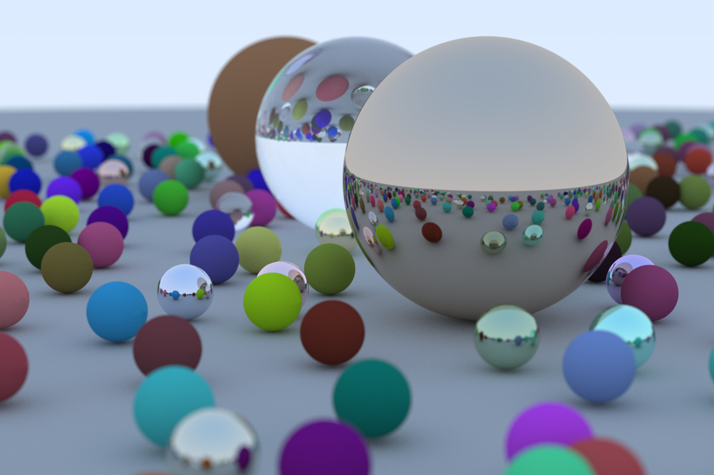

# Ray Tracer

A rust implementation of the code shown in the Peter Shirley's book trilogy [_Ray Tracin_](https://raytracing.github.io/)

At this time only the first book is implemented.
The code is documented but take into consideration that this is my first rust project after the rust book so the code may not be acording to
rust standarts.
